[](https://classroom.github.com/a/XoLGRbHq)
[](https://classroom.github.com/online_ide?assignment_repo_id=15280944&assignment_repo_type=AssignmentRepo)
# SE-Assignment-5
Installation and Navigation of Visual Studio Code (VS Code)
 Instructions:
Answer the following questions based on your understanding of the installation and navigation of Visual Studio Code (VS Code). Provide detailed explanations and examples where appropriate.

 Questions:

1. Installation of VS Code:
   - Describe the steps to download and install Visual Studio Code on Windows 11 operating system. Include any prerequisites that might be needed.


## Steps to download and install Visual Studio Code on Windows 11.

### System Requirements

Ensure your system meets the basic requirements:
- **Storage**: Less than 200 MB for download, disk footprint of less than 500 MB.
- **Hardware**: Visual Studio Code is lightweight and should run smoothly on modern hardware.

## Download Visual Studio Code

Visit the [official Visual Studio Code website](https://code.visualstudio.com) to download the latest version.

There are two main ways to install Visual Studio Code on Windows:
- Using the installer.
- Extracting the zip archive.

### Using the Installer

1. **Download the Installer**:
    - Go to the Visual Studio Code [download page](https://code.visualstudio.com/Download).
    - Download the `VSCodeUserSetup-{version}.exe` file.

2. Step 1: Download Visual Studio Installer
## Step 1: Open Web Browser
1. **Launch your preferred web browser** (e.g., Chrome, Firefox, Edge).

## Step 2: Go to the Visual Studio Website
2. **Navigate to the official Visual Studio download page** by entering the URL: [Visual Studio Website](https://visualstudio.microsoft.com/).

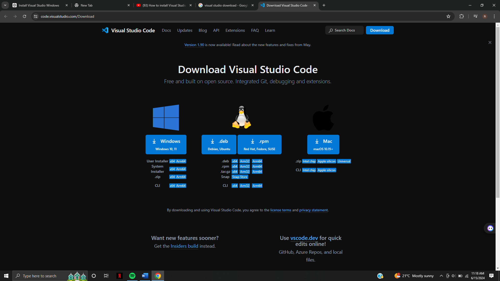


 
## Step 3: Select Version
3. **Choose the edition** you want to install:
   - **Visual Studio Community**: Free for individual developers, open-source projects, academic research, education, and small professional teams.
   - **Visual Studio Professional**: For small teams with advanced features (requires a paid license).
   - **Visual Studio Enterprise**: For larger teams with advanced features (requires a paid license).

## Step 4: Run the Visual Studio Installer
4. **Run the Installer**:
   - Once the installer file is downloaded, open it. You might need to allow the installer to make changes to your device.
   - Click the downloaded file in your web browser (often located in the bottom left corner of the window).
   - If prompted by User Account Control, click "Yes" to allow the installer to run.

   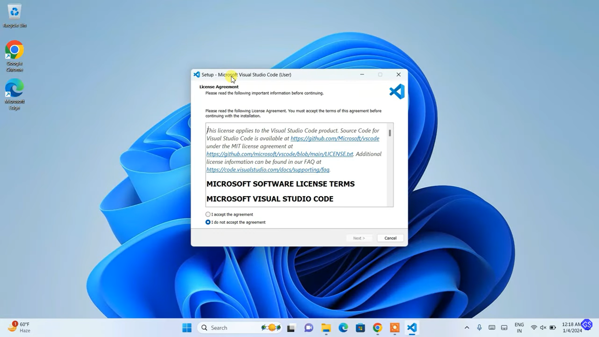

## Step 5: Choose Workloads
5. **Workload Selection Screen**:
   - After the installer initializes, you'll see a list of workloads, which are groups of related tools and libraries for different types of development.
   - Example Workloads include .NET desktop development, ASP.NET and web development, Desktop development with C++, Game development with Unity, etc.

## Step 6: Select Workloads
6. **Select the relevant workloads** by checking the boxes next to them. You can modify your installation later to add or remove workloads.

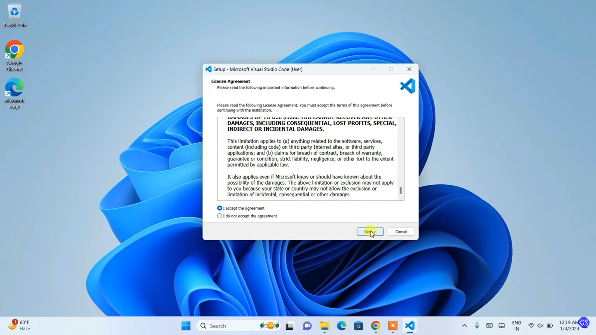

## Step 7: Individual Components (Optional)
7. **Individual Components Tab**:
   - If you need more specific components, navigate to the "Individual components" tab.
   - Here, you can select individual components without selecting an entire workload, useful if you know exactly what you need.

## Step 8: Language Packs (Optional)
8. **Language Packs Tab**:
   - If you prefer Visual Studio in a language other than English, select language packs from the "Language packs" tab.

## Step 9: Installation Location
9. **Choose the Installation Path**:
   - You can select the installation locations for Visual Studio and the download cache. Default locations are usually suitable, but you can customize them if needed.

   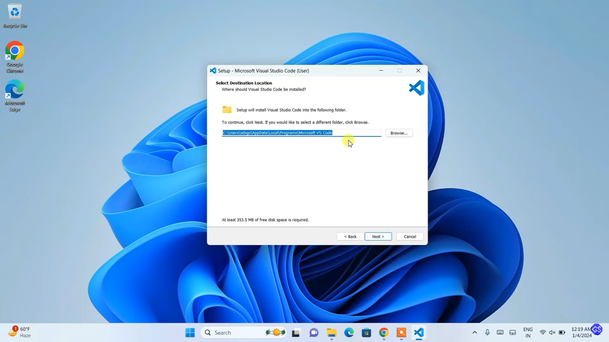

## Step 10: Install
10. **Start the Installation**:
    - After making your selections, click the "Install" button.
    - The installer will begin downloading and installing the selected components. This process may take time depending on your internet speed and selected components.
    - You can continue using your computer during the installation; the Visual Studio installer allows pausing and resuming.

    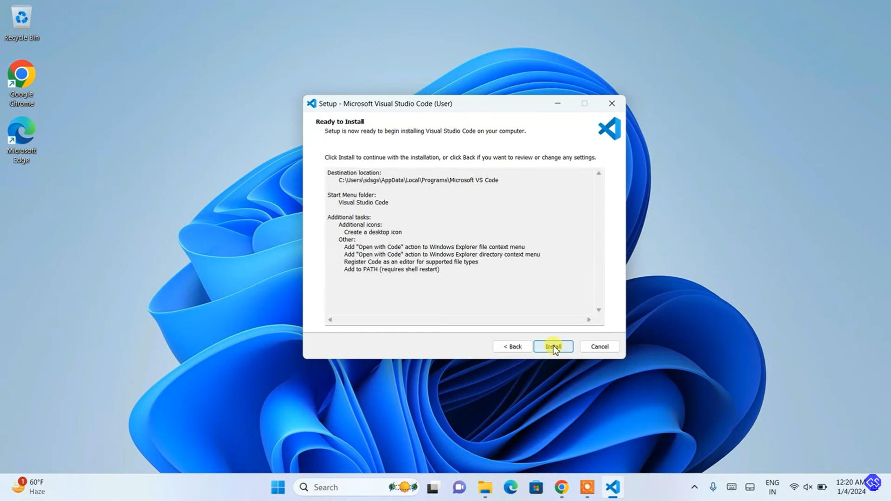

## Step 11: Launch Visual Studio
11. **Complete Installation**:
    - Once installation is finished, click the "Launch" button to start Visual Studio.
    - **Sign In**: If prompted, sign in with your Microsoft account. This step is optional for Community edition but required for Professional and Enterprise editions.
    - **Start Developing**: After signing in (if required), you can start creating or opening projects and developing applications.

    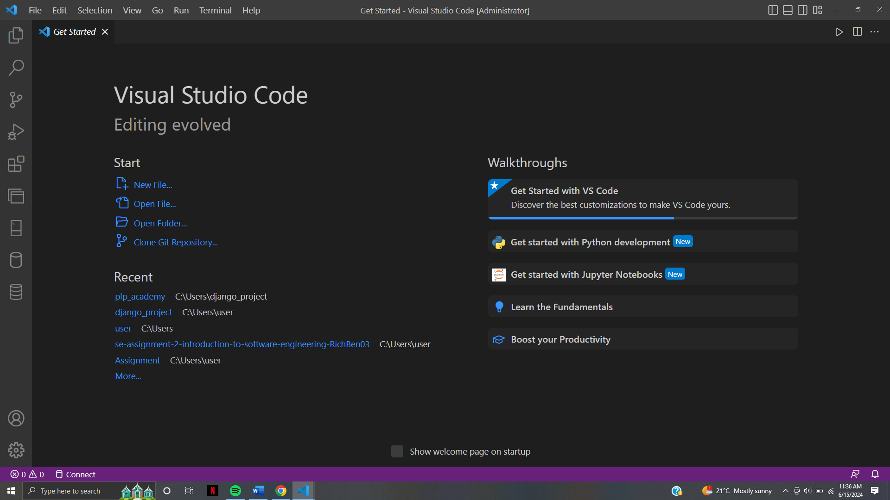

 

2. First-time Setup:
   - After installing VS Code, what initial configurations and settings should be adjusted for an optimal coding environment? Mention any important settings or extensions.
   
# Initial Configurations and Settings for Visual Studio Code

After installing Visual Studio Code, configuring it for an optimal coding environment can significantly enhance your productivity. Here are some essential settings and recommended extensions.

## Basic Settings

1. **Theme and Icon Theme**:
    - Go to `File > Preferences > Color Theme` to select a theme. Popular themes include `Dark+` (default dark) and `Light+` (default light). You can also install additional themes from the [VS Code Marketplace](https://marketplace.visualstudio.com/VSCode).
    - To change the icon theme, go to `File > Preferences > File Icon Theme`.

    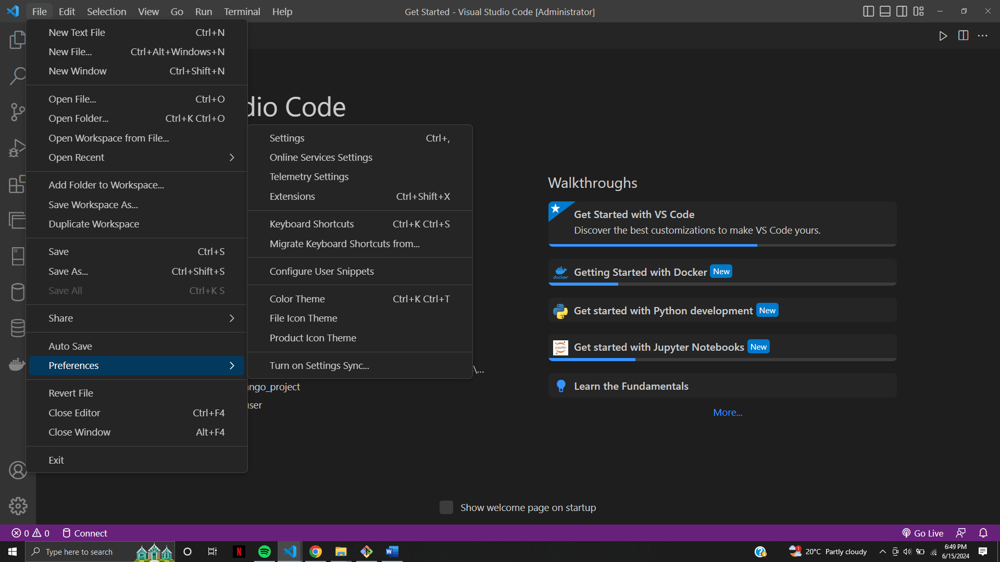

2. **Font and Font Size**:
    - Open `File > Preferences > Settings`.
    - Search for `Font Family` to set your preferred font. Common choices are `Fira Code`, `Source Code Pro`, and `Consolas`.
    - Adjust the `Font Size` to your preference, typically around 14-16px for comfortable viewing.

3. **Tab and Indentation Settings**:
    - Still in `Settings`, search for `Tab Size` to set the number of spaces per tab. Common choices are 2 or 4.
    - Set `Insert Spaces` to ensure VS Code uses spaces instead of tabs for indentation.
    
4. **Auto Save**:
    - Enable auto-save by setting `File > Auto Save` to `afterDelay` or `onWindowChange`.

5. **Word Wrap**:
    - To enable word wrap, go to `Settings` and search for `Word Wrap`. Set it to `on` to wrap long lines of code.

## Key Extensions

1. **Prettier - Code Formatter**:
    - Install from the Extensions view (`Ctrl+Shift+X`).
    - Configure Prettier by adding a `.prettierrc` file to your project or setting options in `Settings > Extensions > Prettier`.
    
      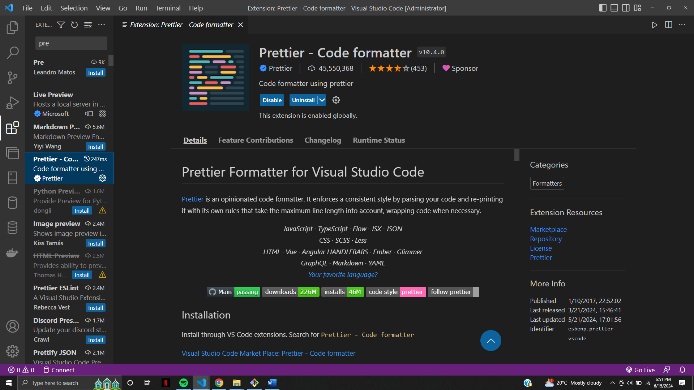


2. **ESLint**:
    - Essential for JavaScript/TypeScript projects.
    - Install the ESLint extension and configure it by adding an `.eslintrc` file to your project.

3. **Live Server**:
    - For web development, install Live Server to launch a local development server with live reload feature.
    - Right-click on an HTML file and select `Open with Live Server`.

    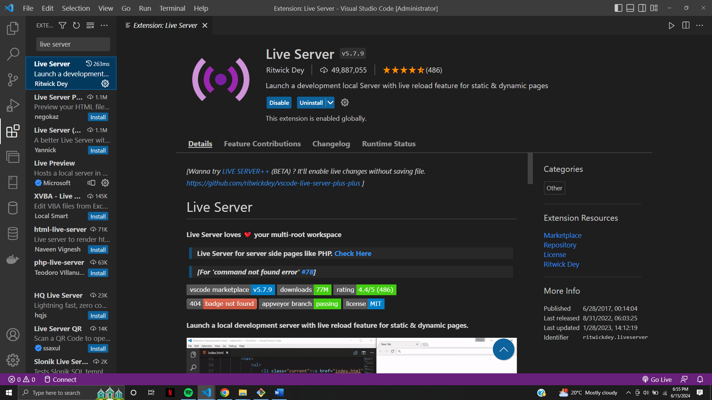


4. **GitLens**:
    - Enhances Git capabilities within VS Code.
    - Provides features like Git blame, code lens, and repository status.

5. **Python**:
    - If you work with Python, install the Python extension by Microsoft.
    - It provides features like IntelliSense, linting, debugging, and Jupyter notebook support.

6. **Docker**:
    - For managing Docker containers and images directly from VS Code.
    - Install the Docker extension to build, manage, and deploy containerized applications.

7. **Remote - WSL**:
    - For developing in a Linux environment on Windows.
    - Install the Remote - WSL extension to open any folder in the Windows Subsystem for Linux and take advantage of VS Code's full feature set.

## Advanced Settings

1. **Settings Sync**:
    - Enable Settings Sync to synchronize your settings, extensions, and keybindings across multiple machines.
    - Go to `Settings` and search for `Settings Sync`. Turn it on and sign in with your Microsoft or GitHub account.

2. **Custom Snippets**:
    - Create custom code snippets for repetitive code blocks.
    - Go to `File > Preferences > User Snippets` and select the language you want to create snippets for.

3. **Keybindings**:
    - Customize keybindings to suit your workflow.
    - Go to `File > Preferences > Keyboard Shortcuts` and modify as needed.

4. **Workspace Settings**:
    - Customize settings per project by creating a `.vscode` folder in your project root and adding a `settings.json` file.
    - Example settings:
      ```json
      {
          "editor.tabSize": 4,
          "editor.insertSpaces": true,
          "editor.formatOnSave": true,
          "files.exclude": {
              "**/.git": true,
              "**/.DS_Store": true,
              "**/node_modules": true
          }
      }
      ```

## Recommended Extensions by Language

- **JavaScript/TypeScript**: 
  - [JavaScript (ES6) code snippets](https://marketplace.visualstudio.com/items?itemName=xabikos.JavaScriptSnippets)
  - [TSLint](https://marketplace.visualstudio.com/items?itemName=ms-vscode.vscode-typescript-tslint-plugin)

- **Python**: 
  - [Python](https://marketplace.visualstudio.com/items?itemName=ms-python.python)
  - [Pylance](https://marketplace.visualstudio.com/items?itemName=ms-python.vscode-pylance)

- **Java**:
  - [Language Support for Java(TM) by Red Hat](https://marketplace.visualstudio.com/items?itemName=redhat.java)
  - [Debugger for Java](https://marketplace.visualstudio.com/items?itemName=vscjava.vscode-java-debug)

- **HTML/CSS**:
  - [HTML CSS Support](https://marketplace.visualstudio.com/items?itemName=ecmel.vscode-html-css)
  - [IntelliSense for CSS class names in HTML](https://marketplace.visualstudio.com/items?itemName=Zignd.html-css-class-completion)

By adjusting these settings and installing recommended extensions, you'll have a powerful and optimized coding environment in Visual Studio Code.


3. User Interface Overview:
   - Explain the main components of the VS Code user interface. Identify and describe the purpose of the Activity Bar, Side Bar, Editor Group, and Status Bar.

   ## Main Components

1. **Activity Bar**
   - **Location**: The vertical bar on the far left of the interface.
   - **Purpose**: Provides access to different views and features in VS Code.
   - **Icons**:
     - **Explorer**: View and manage files and folders in your project.
     - **Search**: Search for files, text, and symbols within your project.
     - **Source Control**: Interface for Git and other version control systems.
     - **Run and Debug**: Access debugging features and run configurations.
     - **Extensions**: Install, manage, and view extensions to enhance VS Code's functionality.

2. **Side Bar**
   - **Location**: The area to the right of the Activity Bar.
   - **Purpose**: Displays views and panels selected from the Activity Bar.
   - **Components**:
     - **Explorer Panel**: Lists project files and directories.
     - **Search Panel**: Allows searching across the project.
     - **Source Control Panel**: Shows changes, branches, and repositories.
     - **Extensions Panel**: Lists installed and recommended extensions.
     - **Debug Panel**: Displays variables, watch expressions, call stack, and breakpoints during debugging.

3. **Editor Group**
   - **Location**: The central area of the interface.
   - **Purpose**: The main area where you write and edit code.
   - **Features**:
     - **Tabs**: Open multiple files in tabs within the editor group.
     - **Split Editors**: Split the editor group horizontally or vertically to view and edit multiple files simultaneously.
     - **Minimap**: A high-level overview of your code, shown on the right side of the editor.

4. **Status Bar**
   - **Location**: The horizontal bar at the bottom of the interface.
   - **Purpose**: Displays information about the current file and the overall state of the editor.
   - **Information**:
     - **Line and Column Number**: Shows the current cursor position.
     - **Language Mode**: Indicates the language of the current file.
     - **Git Branch**: Shows the current Git branch if a repository is open.
     - **Errors and Warnings**: Displays the number of errors and warnings in the current file.
     - **Encoding and EOL**: Shows the file encoding and end-of-line sequence.
     - **Other Indicators**: May show running tasks, notifications, and more.

     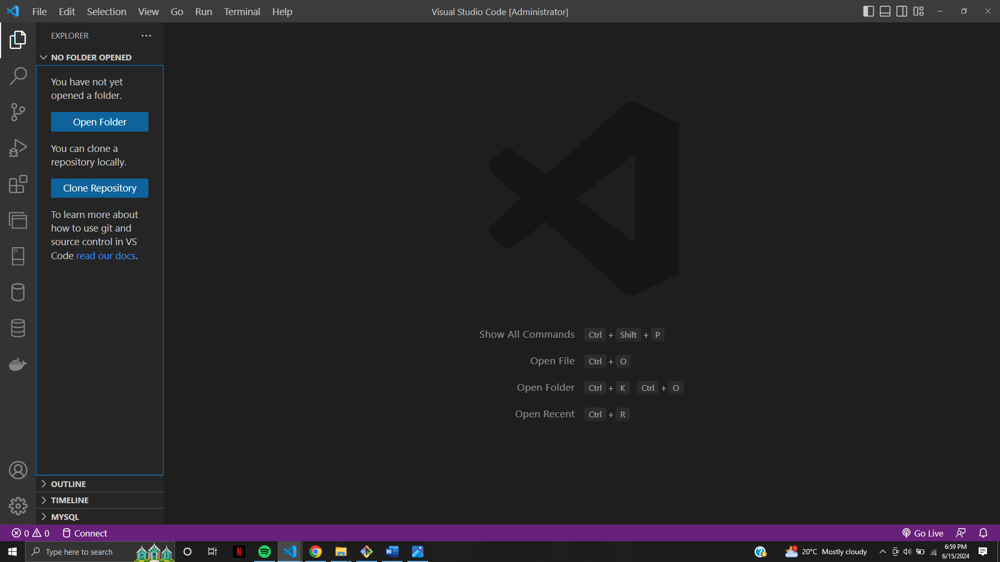


4. Command Palette:
   - What is the Command Palette in VS Code, and how can it be accessed? Provide examples of common tasks that can be performed using the Command Palette.

# Command Palette in Visual Studio Code

The Command Palette a powerful feature in Visual Studio Code (VS Code) which provides a quick access to a wide range of commands and functionality, making it easier to perform tasks without navigating through menus.

## What is the Command Palette?

The Command Palette allows users to execute commands, open files, and perform various tasks efficiently. It acts as a centralized interface for almost all operations in VS Code.

## How to Access the Command Palette

- **Windows/Linux**: Press `Ctrl+Shift+P` or `F1`.
- **macOS**: Press `Cmd+Shift+P` or `F1`.

When you open the Command Palette, a text input box appears at the top of the screen, where you can type commands or keywords.

## Common Tasks Using the Command Palette

Here are some examples of common tasks you can perform using the Command Palette:
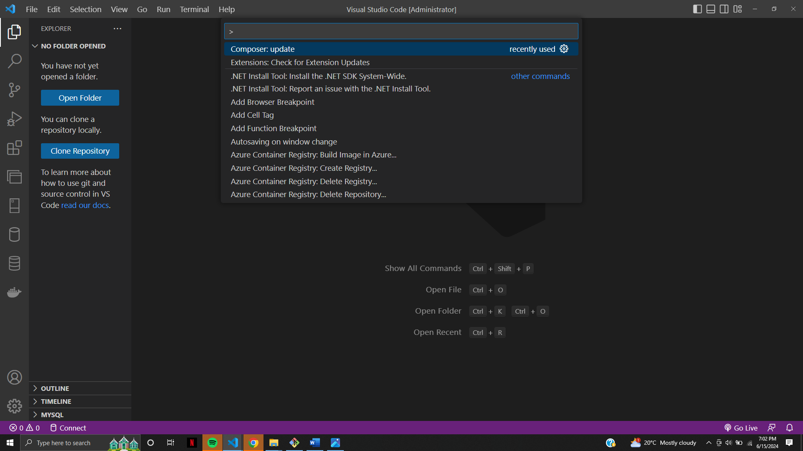

1. **File Operations**:
    - **Open File**: Type `>Open File` to quickly open a file.
    - **Save File**: Type `>File: Save` to save the current file.
    - **Close File**: Type `>File: Close` to close the current file.

2. **Editor Actions**:
    - **Split Editor**: Type `>View: Split Editor` to split the editor horizontally or vertically.
    - **Toggle Word Wrap**: Type `>View: Toggle Word Wrap` to enable or disable word wrap in the editor.
    - **Change Language Mode**: Type `>Change Language Mode` to switch the language mode for the current file.

3. **Search and Replace**:
    - **Find in Files**: Type `>Search: Find in Files` to search for text across your project.
    - **Replace in Files**: Type `>Search: Replace in Files` to perform a find-and-replace operation across your project.

4. **Git Commands**:
    - **Git: Commit**: Type `>Git: Commit` to commit changes to the repository.
    - **Git: Pull**: Type `>Git: Pull` to pull the latest changes from the remote repository.
    - **Git: Push**: Type `>Git: Push` to push your changes to the remote repository.

5. **Extension Management**:
    - **Install Extension**: Type `>Extensions: Install Extensions` to open the Extensions view and install new extensions.
    - **Disable Extension**: Type `>Extensions: Disable` to disable an installed extension.

6. **Debugging**:
    - **Start Debugging**: Type `>Debug: Start Debugging` to start a debugging session.
    - **Add Configuration**: Type `>Debug: Add Configuration` to add or modify debug configurations.

7. **Settings and Preferences**:
    - **Open Settings**: Type `>Preferences: Open Settings` to access the settings editor.
    - **Configure User Snippets**: Type `>Preferences: Configure User Snippets` to create or edit custom code snippets.

## Tips for Using the Command Palette

- **Command Suggestions**: As you type, the Command Palette suggests commands based on your input, making it easier to find what you need.
- **Keyboard Shortcuts**: Frequently used commands have associated keyboard shortcuts displayed next to them in the Command Palette.
- **History**: The Command Palette remembers your previously executed commands, allowing you to quickly repeat actions.

5. Extensions in VS Code:
   - Discuss the role of extensions in VS Code. How can users find, install, and manage extensions? Provide examples of essential extensions for web development.

   ## The Role of Extensions

Extensions extend the capabilities of VS Code, enabling features such as syntax highlighting, code completion, debugging tools, linters, and more. They are essential for adapting VS Code to various development workflows and languages.

## Finding and Installing Extensions

### Accessing Extensions

- **Using the Activity Bar**: Click on the Extensions icon in the Activity Bar on the left side of the window (`Ctrl+Shift+X`).
- **Command Palette**: Open the Command Palette (`Ctrl+Shift+P` or `Cmd+Shift+P` on macOS) and type `Extensions: Install Extensions`.

### Searching for Extensions

In the Extensions view, you can search for extensions by name, category, or keyword. The search bar at the top allows you to filter results based on your criteria.

### Installing Extensions

1. **Find an Extension**: Browse or search for the desired extension.
2. **Install**: Click the `Install` button next to the extension's name. After installation, the extension will be available for use immediately or may require a restart.

## Managing Extensions

### Viewing Installed Extensions

In the Extensions view, switch to the `Installed` tab to see all the extensions you have installed. Here, you can enable, disable, or uninstall extensions.

### Updating Extensions

VS Code automatically checks for updates to installed extensions. If updates are available, you will see an update button in the Extensions view, allowing you to update extensions individually or all at once.

### Configuring Extensions

Many extensions offer settings that can be customized. Access these settings by clicking the gear icon next to the extension's name in the Extensions view and selecting `Extension Settings`.

## Essential Extensions for Web Development

Here are some highly recommended extensions for web development:

1. **Prettier - Code Formatter**: Ensures consistent code formatting.
    - **Install**: Search for `Prettier - Code Formatter` in the Extensions view and click `Install`.
    
2. **ESLint**: Integrates ESLint into VS Code for identifying and fixing JavaScript code issues.
    - **Install**: Search for `ESLint` and click `Install`.

3. **Live Server**: Launches a local development server with live reload feature for static and dynamic pages.
    - **Install**: Search for `Live Server` and click `Install`.

4. **Bracket Pair Colorizer**: Highlights matching brackets with different colors for better readability.
    - **Install**: Search for `Bracket Pair Colorizer` and click `Install`.

5. **Path Intellisense**: Provides path autocompletion for file imports.
    - **Install**: Search for `Path Intellisense` and click `Install`.

6. **HTML CSS Support**: Enhances HTML and CSS support in VS Code.
    - **Install**: Search for `HTML CSS Support` and click `Install`.

7. **IntelliSense for CSS class names in HTML**: Offers CSS class name autocompletion in HTML files.
    - **Install**: Search for `IntelliSense for CSS class names in HTML` and click `Install`.

8. **Debugger for Chrome**: Allows debugging of JavaScript code running in Google Chrome directly from VS Code.
    - **Install**: Search for `Debugger for Chrome` and click `Install`.

Extensions significantly boost productivity and adapt VS Code to specific development needs, making it a versatile tool for any developer.

6. Integrated Terminal:
   - Describe how to open and use the integrated terminal in VS Code. What are the advantages of using the integrated terminal compared to an external terminal?

### Opening and Using the Integrated Terminal
To open the integrated terminal in Visual Studio Code (VS Code):
- **Via Menu**: Go to `View` > `Terminal`.
- **Keyboard Shortcut**: Press `` Ctrl+` `` (Control and backtick).

Once open, you can use the terminal just like any standard command-line interface. You can create multiple terminal instances, switch between them, and even run different shell types (bash, PowerShell, etc.).

### Advantages of the Integrated Terminal
- **Convenience**: Seamlessly work within a single application.
- **Context Awareness**: Automatically opens in the workspace directory, reducing navigation time.
- **Panel Management**: Easily switch between the terminal, output, and other panels without losing context.
- **Multi-Terminal Support**: Run multiple terminal instances and switch between them with ease.

7. File and Folder Management:
   - Explain how to create, open, and manage files and folders in VS Code. How can users navigate between different files and directories efficiently?

   ### Creating, Opening, and Managing Files and Folders
- **Creating**:
  - **New File**: Click the `New File` icon in the Explorer panel or use `Ctrl+N`.
  - **New Folder**: Click the `New Folder` icon or right-click in the Explorer panel and select `New Folder`.

- **Opening**:
  - **Open File**: Use `Ctrl+O` or drag and drop files into the editor.
  - **Open Folder**: Use `File` > `Open Folder` or `Ctrl+K Ctrl+O`.

- **Managing**:
  - **Rename**: Right-click on a file/folder and select `Rename`.
  - **Move**: Drag and drop files/folders to rearrange.
  - **Delete**: Right-click and select `Delete`.

### Efficient Navigation
- **Quick Open**: Press `Ctrl+P` and start typing the file name.
- **Breadcrumbs**: Navigate through file paths using the breadcrumbs at the top of the editor.
- **File Explorer**: Use the side panel to browse and open files.

8. Settings and Preferences:
   - Where can users find and customize settings in VS Code? Provide examples of how to change the theme, font size, and keybindings.

   ### Customizing Settings
- **Access Settings**:
  - **GUI**: `File` > `Preferences` > `Settings` or `Ctrl+,`.
  - **JSON**: Click the `{}` icon in the settings UI to edit the `settings.json` file directly.

### Changing Theme, Font Size, and Keybindings
- **Theme**:
  - Go to `File` > `Preferences` > `Color Theme` or `Ctrl+K Ctrl+T`.
  - Select from the available themes or install new ones from the marketplace.

- **Font Size**:
  - In the settings search bar, type `Font Size` and adjust the value.

- **Keybindings**:
  - Access via `File` > `Preferences` > `Keyboard Shortcuts` or `Ctrl+K Ctrl+S`.
  - Modify keybindings by clicking on the action and entering the desired shortcut.

9. Debugging in VS Code:
   - Outline the steps to set up and start debugging a simple program in VS Code. What are some key debugging features available in VS Code?
   ### Setting Up and Starting Debugging
1. **Open Debug Panel**: Click on the debug icon in the Activity Bar or press `Ctrl+Shift+D`.
2. **Configure Debugger**:
   - Click `create a launch.json file` link if no configuration exists.
   - Select the appropriate environment (e.g., Node.js, Python).
3. **Set Breakpoints**: Click in the gutter next to the line numbers where you want to add a breakpoint.
4. **Start Debugging**:
   - Press `F5` or click the green play button.

### Key Debugging Features
- **Breakpoints**: Pause execution at specified lines.
- **Watch**: Monitor variable values.
- **Call Stack**: View the call stack to trace execution flow.
- **Variables**: Inspect and modify variables during execution.
- **Debug Console**: Execute commands and evaluate expressions.

10. Using Source Control:
    - How can users integrate Git with VS Code for version control? Describe the process of initializing a repository, making commits, and pushing changes to GitHub.

    ### Integrating Git with VS Code
1. **Initialize Repository**:
   - Open the Source Control panel by clicking the source control icon in the Activity Bar.
   - Click `Initialize Repository` button.

2. **Making Commits**:
   - Stage changes by clicking the `+` icon next to modified files.
   - Enter a commit message in the input box at the top.
   - Click the checkmark icon to commit the changes.

3. **Pushing Changes to GitHub**:
   - Ensure your project is connected to a remote repository.
   - Click the `...` menu in the Source Control panel and select `Push`.
   - Enter your GitHub credentials if prompted.

 Submission Guidelines:
- Your answers should be well-structured, concise, and to the point.
- Provide screenshots or step-by-step instructions where applicable.
- Cite any references or sources you use in your answers.
- Submit your completed assignment by 1st July 

